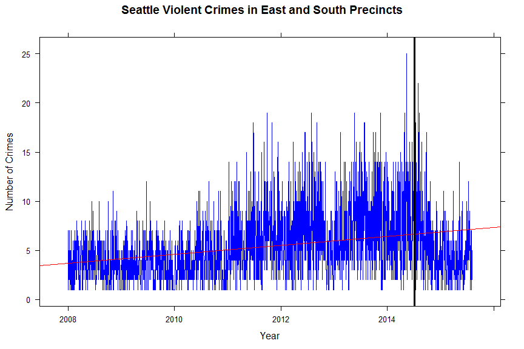
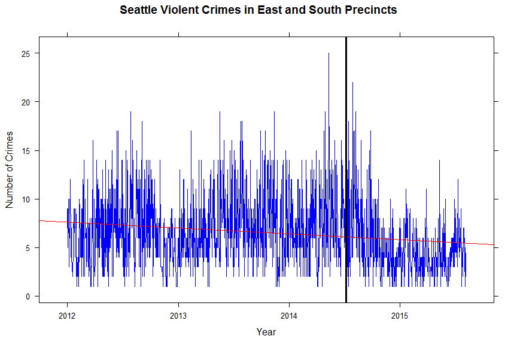
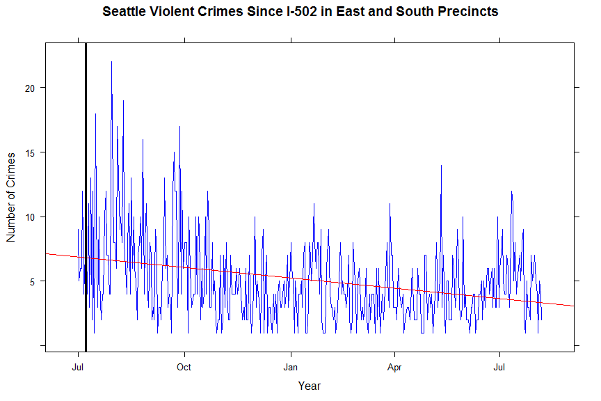

# Seattle Crime & I-502 in the Central and South Precincts, 2008-2014
Thomas P Kiehne  
Friday, August 07, 2015  


## Synopsis

Question: Has the implementation of I-502 (the marijuana legalization initiative of 2012) caused an upsurge of gang crime activity in the Central and South districts of Seattle?  We look at the [crime data published by the City of Seattle](https://data.seattle.gov) focusing specifically on the East and South precincts of the city where gang activity is most prevalent.  An analysis of reported crime does not appear to indicate an upsurge of crime activity after the implementation of I-502.


## Data Processing

Crime data are available from the City of Seattle in a well organized format that is divided by police sector and crime type.  This specific data set is based on initial police reports taken by officers when responding to incidents around the city. It is worth noting that this analysis is based on data collected when police are dispatched to investigate a crime report, which implies that unreported crime is not represented.  However, it is assumed that any increase in unreported crime would induce a similar signal in reported crime.

Data are read directly from the City of Seattle site for processing:


```r
library(dplyr, warn.conflicts=F, quietly=T)

# get data
if(!file.exists("Seattle_Police_Department_Police_Report_Incident.csv"))
{
  download.file("https://data.seattle.gov/api/views/7ais-f98f/rows.csv?accessType=DOWNLOAD", "Seattle_Police_Department_Police_Report_Incident.csv", method="internal", mode="w")
}

# read data
crime <- read.csv("Seattle_Police_Department_Police_Report_Incident.csv")
```

For this analysis we are interested in violent crimes specifically, but add narcotics, weapons, and other violent crimes as a proxy for the sorts of activities that might be reported in relation to gang activity. Data are read directly from the City of Seattle site and processed to filter out crimes and beats that are not relevant to our study.

Then we filter out reports from before 2008 and retain [police sectors](http://spdblotter.seattle.gov/2015/01/27/spd-adds-supervisors-shifts-police-beats-as-part-of-reform-efforts/) representing the Central District, Capitol Hill, and points south that comprise most of the East and South precincts:


```r
# convert dates to date objects
crime <- mutate(crime, Date.Reported = as.Date(Date.Reported, "%m/%e/%Y"))

# since 2008
crime <- filter(crime, Date.Reported >= "2008-01-01")

# South and East precincts only
crime <- filter(crime, District.Sector %in% c("E", "C", "G", "R", "S"))
```

Then we filter out all crimes that are not related to violent crimes, weapons, weapons discharge, and narcotics; marijuana related crimes are specifically excluded to avoid bias between the before and after I-502 period:


```r
# specific crimes only
crimefilter <- c("ASSLT-AGG-BODYFORCE", "ASSLT-AGG-GUN", "ASSLT-AGG-WEAPON", "ASSLT-OTHER", "DRIVE-BY", "HOMICIDE-JUST-GUN", "HOMICIDE-JUST-WEAPON", "HOMICIDE-NEG-MANS-BODYFORCE", "HOMICIDE-NEG-MANS-GUN", "HOMICIDE-PREMEDITATED-BODYFORC", "HOMICIDE-PREMEDITATED-GUN", "NARC-DISTRIBUTE-HALLUCINOGEN", "NARC-DRUG TRAFFIC LOITERING", "NARC-EQUIPMENT/PARAPHENALIA", "NARC-FORGERY-PRESCRIPTION", "NARC-FOUND-AMPHETAMINE", "NARC-FOUND-COCAINE", "NARC-FOUND-HALLUCINOGEN", "NARC-FOUND-HEROIN", "NARC-FOUND-METH", "NARC-FOUND-OPIUM", "NARC-FOUND-PILL/TABLET", "NARC-FOUND-SYNTHETIC", "NARC-FRAUD-PRESCRIPTION", "NARC-MANUFACTURE-HALLUCINOGEN", "NARC-MANUFACTURE-OTHER", "NARC-POSSESS-AMPHETAMINE", "NARC-POSSESS-BARBITUATE", "NARC-POSSESS-COCAINE", "NARC-POSSESS-HALLUCINOGEN", "NARC-POSSESS-HEROIN", "NARC-POSSESS-METH", "NARC-POSSESS-OPIUM", "NARC-POSSESS-PILL/TABLET", "NARC-POSSESS-PRESCRIPTION", "NARC-POSSESS-SYNTHETIC", "NARC-SELL-AMPHETAMINE", "NARC-SELL-BARBITUATE", "NARC-SELL-COCAINE", "NARC-SELL-HALLUCINOGEN", "NARC-SELL-HEROIN", "NARC-SELL-METH", "NARC-SELL-OPIUM", "NARC-SELL-PILL/TABLET", "NARC-SELL-PRESCRIPTION", "NARC-SELL-SYNTHETIC", "NARC-SMUGGLE-COCAINE", "NARC-SMUGGLE-METH", "NARC-SMUGGLE-OTHER", "ROBBERY-RESIDENCE-GUN", "ROBBERY-RESIDENCE-WEAPON", "ROBBERY-STREET-BODYFORCE", "ROBBERY-STREET-GUN", "ROBBERY-STREET-WEAPON", "THREATS-KILL", "THREATS-OTHER", "THREATS-WEAPON", "WEAPON-CONCEALED", "WEAPON-DISCHARGE", "WEAPON-POSSESSION", "WEAPON-SELLING", "WEAPON-SURRENDER-EXCLUDING FIR", "WEAPON-UNLAWFUL USE")

crime <- filter(crime, Offense.Type %in% crimefilter)
```


## Results

Using the prepared data, we can look visually at the reported crime trends in the East and South precincts from 2008-2014. A linear trend line is shown in red and the date of the first I-502 shop opening in Seattle (July 8, 2014) is indicated by the vertical black line.


```r
library(lattice)

rate0815 <- aggregate(RMS.CDW.ID ~ Date.Reported, data=crime, FUN=length)
xyplot(RMS.CDW.ID ~ Date.Reported, data=rate0815,
       panel=function(x, y, col, ...) {
         panel.xyplot(x, y, col="blue", ...)
         panel.lmline(x, y, col="red")
         panel.abline(v=as.Date("2014-07-08"), col="black", lwd=3)
       },
       type="l",
       xlab="Year", 
       ylab="Number of Crimes", 
       main="Seattle Violent Crimes in East and South Precincts"
)
```



We see an overall upward trend over the more than 7 year period.  This signal is diffiult to interpret given the changes in population and other social factors that occurred over this time.  To gain clarity we need to examine the trends in more recent time periods.

I-502 was approved by voters in November of 2012, but implementation did not occur for more than a year as WSLCB finalized rules and procedures.  The first recreational pot store in Seattle opened in July of 2014 meaning that prior to that month no legal marijuana was availabe to the public.  Therefore, if any significant crime impact due to the introduction of legal pot were to occur it would be after that date.  

We can assess this hypothesis by looking visually at the crime trends for the subject areas from 2012 through 2015 to date.


```r
rate1214 <- filter(rate0815, Date.Reported >= "2012-01-01")
xyplot(RMS.CDW.ID ~ Date.Reported, data=rate1214,
       panel=function(x, y, col, ...) {
         panel.xyplot(x, y, col="blue", ...)
         panel.lmline(x, y, col="red")
         panel.abline(v=as.Date("2014-07-08"), col="black", lwd=3)
       },
       type="l",
       xlab="Year", 
       ylab="Number of Crimes", 
       main="Seattle Violent Crimes in East and South Precincts"
)
```



We can clearly see a slight downward trend over more than three years covering the time immediately before and after the availability of legal pot in Seattle.  This suggests that the signal increase we saw in the 2008 and later plot was spent by or soon after 2012.

To take it one step further, we can look at the trend since the opening of marijuana sales in Seattle on July 2014:


```r
ratepost <- filter(rate0815, Date.Reported >= "2014-07-01")
xyplot(RMS.CDW.ID ~ Date.Reported, data=ratepost,
       panel=function(x, y, col, ...) {
         panel.xyplot(x, y, col="blue", ...)
         panel.lmline(x, y, col="red")
         panel.abline(v=as.Date("2014-07-08"), col="black", lwd=3)
       },
       type="l",
       xlab="Year", 
       ylab="Number of Crimes", 
       main="Seattle Violent Crimes Since I-502 in East and South Precincts"
)
```



Here we see a significant decline in violent and drug crimes since the implementation of I-502. The analysis is not consistent with the premise that crime has increased with the passage and implementation of I-502.
